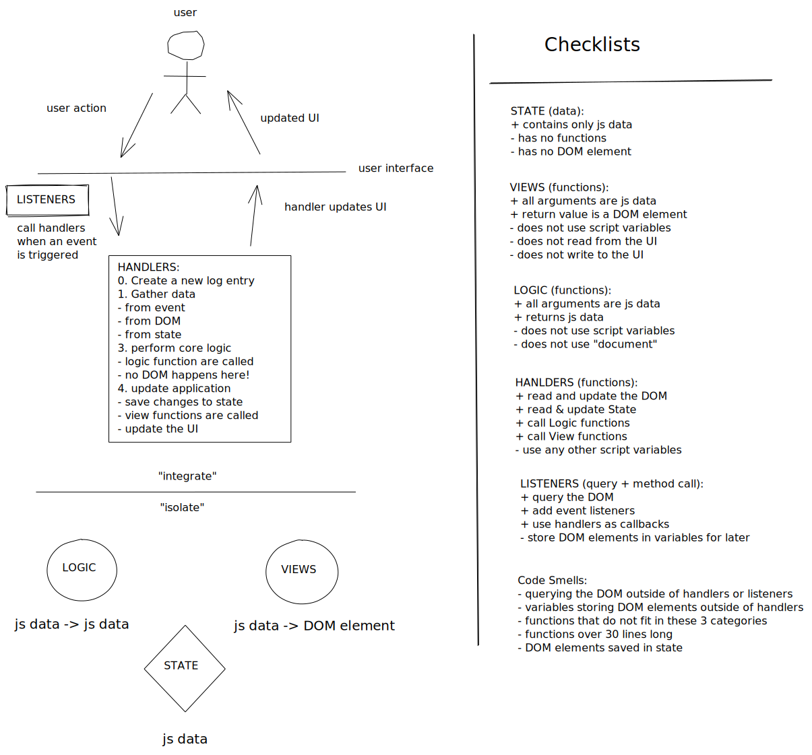

# State

> "In information technology and computer science, a system is described as stateful if it is designed to remember preceding events or user interactions; the remembered information is called the state of the system."
>
> - [Wikipedia](<https://en.wikipedia.org/wiki/State_(computer_science)>)

## Contents

- [Getting Started](#getting-started)
- [Study Tips](#study-tips)
- [Learning Objectives](#learning-objectives)
- [About the Projects](#about-the-projects)
- [Suggested Study](#suggested-study)
- Sundays
  - [Week 1](#week-1)
  - [Week 2](#week-2)
- [Class Recordings](#class-recordings)
- [Curriculum](https://home.hackyourfuture.be/curriculum) (external)
- [HYF Home](https://home.hackyourfuture.be/) (external)

---

## Getting Started

How to study the code in this repo.

<details>
<summary>expand/collapse</summary>
<br>

> You will need [NPM](https://docs.npmjs.com/downloading-and-installing-node-js-and-npm) and [nvm](https://github.com/nvm-sh/nvm#installing-and-updating) on your computer to study this material
>
> Using a browser with good DevTools will make your life easier: [Chromium](http://www.chromium.org/getting-involved/download-chromium), [FireFox](https://www.mozilla.org/en-US/firefox/new/), [Edge](https://www.microsoft.com/edge), [Chrome](https://www.google.com/chrome/)

1. Install or update the `study-lenses` package globally
   - `npm install -g study-lenses` (if you do not have it already)
   - `npm update -g study-lenses` (if you already have it installed)
1. Clone this repository:
   - `git clone git@github.com:HackYourFutureBelgium/separation-of-concerns.git` (SSH) (recommended)
   - `git clone https://github.com/HackYourFutureBelgium/separation-of-concerns.git` (HTTPS)
   - `gh repo clone HackYourFutureBelgium/separation-of-concerns` (GH CLI)
1. `cd` into the repository
   - `cd separation-of-concerns`
1. Run the `study` command from your CLI
   - `study`
1. The material will open in your default browser, you're good to go!

> If you have a windows computer and get this error:
>
> - `... /study.ps1 cannot be loaded because running scripts ...`
>
> follow the instructions in [this StackOverflow answer](https://stackoverflow.com/a/63424744), that should take care of it ; )

</details>
<br>

[TOP](#state)

---

## Study Tips

- Don't rush, understand! Programming is hard.
  - The examples and exercises will still be there to study later.
  - It's better to fail tests slowly and learn from your mistakes than to pass tests quickly and not understand why.
- Don't skip the examples! Understanding and experimenting with working code is a very effective way to learn programming.
- Practice [Pair Programming](https://study.hackyourfuture.be/collaborating/pair-programming): two people, one computer./

Not all assignments are created equal. These 3 emoji's will help you figure out how to spend your study time as effectively as possible.

- 🥚 `:egg:` - these assignments are required, they cover the base skills you'll need to move on.
- 🐣 `:hatching_chick:` - do your best to start these exercises. you don't need to finish or master them (yet) but getting the main idea will be helpful in coming weeks
- 🐥 `:hatched_chick:` - Have you finished all the 🥚's and started all the 🐣's? push yourself with these challenges!

[TOP](#state)

---

## Learning Objectives

<details>
<summary>expand/collapse</summary>
<br>

### Vocabulary

_State_, _Log_ and _Render_ are not words that come from JS or Web Development. They are general programming concepts. Any software that stores data has _state_. Any software that keeps track of user interactions for debugging uses _logging_. Any software with a user interface _renders_ data for the user.

- **State**
  - Information that is useful for the User of the program
  - One can use any data structure or data type to store this information (objects/arrays/numbers/...)
- **Log**
  - It is like a diary/journal. A person logs an activity, a program logs an action/location/variables etc.
  - Note that developers can also decide to log the _state_ of the program.
  - Also note the name of console.log() function is purposeful! It prints(logs) on the console.
  - It is also possible to print(log) to a file instead of console, which is a more common practice.
  - Want to see file logging in real life?
    1. open this repo with `study`
    2. watch the console output in your terminal
    3. those are server logs! a record of every [request and response](https://www.youtube.com/watch?v=DrI2lUXL1no) sent by the `study-lenses`
- **Render**
  - The term comes from the Computer Graphics.
  - Rendering simply means drawing something on the computer screen.
  - Rendering can also mean making something visual or preparing a view for your data.

### Programming Skills

- Data-first development
  - Understanding applications as Data + User Interactions
  - Developing from the "inside" out: planning the data & logic of your app without a user interface
- Defining _State_
  - Determining what data is important for a user
  - Choosing the correct JS data structure for you state
  - Separating important data from local variables
- Logging
  - Capture and store a log of all user interactions & state changes
  - Use this log to reconstruct user actions and debug your projects
- Dynamically update the DOM to represent the current state
  - Render data into DOM elements
  - Re-render portions of the DOM for a reactive experience

### Project Planning

- Using a _backlog_ to set priorities
- Writing _acceptance criteria_ to describe user stories
- Creating a user-story dependency chart to plan your development schedule
- Breaking user stories into code-able tasks

</details>
<br>

[TOP](#state)

---

## About the Projects

In the previous module you learned to decompose & plan projects, organize your code, and use HTML/CSS/JS to implement simple websites that process user input. All well and good but there was something missing. Your projects never "remembered" anything.

Enter: **State**. This is a fancy programming term to talk about the _data_ stored by your web pages. Nearly every app you use has state -> message histories, images, profile details, weather reports, ... you name it! Data is the core of any application. Just like you learned to write tests to describe your functions and show that they do what they should, you will learn how to use schemas and validation to prove that your program data in fact what you say it is.

Your new projects will be more interesting, but they will also be a more complicated. The logic will be more challenging, and the data saved in your page will change over time leading to bugs you could never have imagined.

To help you understand and debug your projects you will learn about **logging** - this is a technique where you store a record of every user interaction, all user input, and each _state change_. It will take some time before you're comfortable logging your projects. Once you are familiar with this technique you will find that it is helpful way to simplify and understand what is happening in your program.

<details>
<summary>project diagram</summary>
<br>

[](https://excalidraw.com/#json=6555846108512256,LRCbA630IGfK6OaqUNwUjw)

</details>
<br>

[TOP](#state)

---

## Suggested Study

Helpful links, examples and exercises.

<details>
<summary>expand/collapse</summary>
<br>

- [What is state and why should we care about it?](https://dev.to/codeartistryio/what-is-state-and-why-should-we-care-about-it-4o95)
- Code in this Repo
  - 🥚 [stepped](./stepped?--defaults) (examples): single-file projects that have been built one step at a time
  - 🥚 [fill-in-the-blanks](./fill-in-the-blanks?--defaults) (exercises): single-file projects with some code to complete
  - 🥚 [refactors](./refactors?--defaults) (exercises): practice refactoring code from a single JS file to separated JS files
  - 🐣 [separated](./separated?--defaults) (examples): projects to study that are separated into many folders and files.
  - 🐣 [rendering-data](./rendering-data?--defaults) (exercises): write functions that turn JS data into DOM elements, practice inspecting elements in the DOM and debugger to check your work.
  - 🐥 [testing-views](./testing-views?--defaults) (exercises): learn how to read and pass tests for view functions(tests in this directory must be run in Node.js, they will not work in the browser)
- DOM Elements: Attributes vs. Properties
  - [javascript.info](https://javascript.info/dom-attributes-and-properties)
  - [FullstackTraning](https://blog.fullstacktraining.com/html-attributes-vs-dom-properties/) (article)
  - [WebTunings](https://www.youtube.com/watch?v=9DWKjn969lM) (video)
  - StackOverflow: [the difference](https://stackoverflow.com/questions/6003819/what-is-the-difference-between-properties-and-attributes-in-html), [when to use which](https://stackoverflow.com/questions/3919291/when-to-use-setattribute-vs-attribute-in-javascript)
- [Learn DOM Rendering](https://github.com/oliverjam/learn-dom-rendering)
- [Learn Form Validation](https://github.com/oliverjam/learn-form-validation)
- Nodes vs. Elements
  - [Web Tunings](https://www.youtube.com/watch?v=FrX1bzWc8O4)
  - [StackOverflow](https://stackoverflow.com/questions/9979172/difference-between-node-object-and-element-object)
- Tutorials to refactor
  - [Rock Paper Scissors (traversy)](https://www.youtube.com/watch?v=WR_pWXJZiRY)

</details>

[TOP](#state)

---

## Week 1

The focus of week 1 is storing important data in an object called _state_, and logging all user interactions with this data.

You will start a two-week group project to build a JavaScript quiz app. We give you starter code, you do the rest :)

<details>
<summary>expand/collapse</summary>
<br>

### Before Class

- [What is state and why should we care about it?](https://dev.to/codeartistryio/what-is-state-and-why-should-we-care-about-it-4o95)
- [What is Logging?](https://www.bmc.com/blogs/monitoring-logging-tracing/)
- [stepped](./stepped?--defaults): take a look through these incremental example projects

### During Class

#### Before Break

- [Application State](./isolate/index.html) (examples & exercises)

#### After Break

- [Application State](./integrate/README.md) (examples & exercises)

### Project

> after class

This week's project is to write a JS Quiz. You'll be given:

- [Starter code](https://github.com/HackYourFutureBelgium/state-project-js-quiz)
- [An initial state](https://github.com/HackYourFutureBelgium/state-project-js-quiz/tree/master/src/data.js)
- [A list of possible user stories](https://github.com/HackYourFutureBelgium/state-project-js-quiz/tree/master/user-stories.md)

The rest is up to you!

#### Checklist

```md
- [ ] [repo](https://github.com/_/_) (with a complete README)
- [ ] [live demo](https://_.github.io/_)
- [ ] [backlog](https://github.com/_/_/tree/master/backlog.md)
- [ ] [development-strategy](https://github.com/_/_/tree/master/development-strategy.md)
- [ ] [A project board](https://github.com/_/_/projects/X)
- [ ] [One branch per step in `development-strategy.md`](https://github.com/_/_/network)
- [ ] [One closed issue per task](https://github.com/_/_/issues?q=is%3Aissue+is%3Aclosed) (you can have more than task per development step!)
- [ ] [One closed PR per task issue](https://github.com/_/__/pulls?q=is%3Apr+is%3Aclosed)
```

</details>

[TOP](#state)

---

## Week 2

The focus of week 2 is learning how to render data into DOM elements to create interactive user interfaces.

### Prep Work

> before class

- Rendering Data Examples: Isolate & Integrate
- Nodes vs. Elements
  - [Web Tunings](https://www.youtube.com/watch?v=FrX1bzWc8O4)
  - [StackOverflow](https://stackoverflow.com/questions/9979172/difference-between-node-object-and-element-object)

### Lesson Plan

> during class

#### [Isolate](../isolate/index.html)

[2. Rendering Data](./isolate/index.html)

#### [Integrate](../integrate/README.md)

[2. Rendering Data](./integrate/README.md)

### Project

> after class

Finish up the JS Quiz from last week.

[TOP](#state)

---

## Class Recordings

Screen recordings of class. Coaches, when sending your PR's with links please ...

- Add a link to your video in the correct module's section
- Indicate which class you were teaching
- Which week it was
- Give your name
- and a helpful description

---

### Classes 9 & 10

[Unmesh](https://github.com/unmeshvrije), [Sali](https://github.com/Sali-Almurshidi), [Ismaila](https://github.com/auloin), [Louis](https://github.com/Mamboleoo)

#### Week 1

1. [State & Logging](https://vimeo.com/448445380)
1. [Object vs. State](https://vimeo.com/448849518)
1. [Integrating State](https://vimeo.com/448849847)

#### Week 2

1. [Project Planning & Isolate Rendering Data pt. 1](https://vimeo.com/451212160)
1. [Isolate Rendering Data pt. 2 & Elements vs. Nodes](https://vimeo.com/451212701)
1. [Integrate Rendering Data](https://vimeo.com/451213025)
1. [Listener vs. Handler & Quiz Refactor pt. 1](https://vimeo.com/451213285)
1. [Quiz Refactor pt. 2](https://vimeo.com/451213479)
1. [Quiz Refactor pt. 3](https://vimeo.com/451213762)

[TOP](#state)
